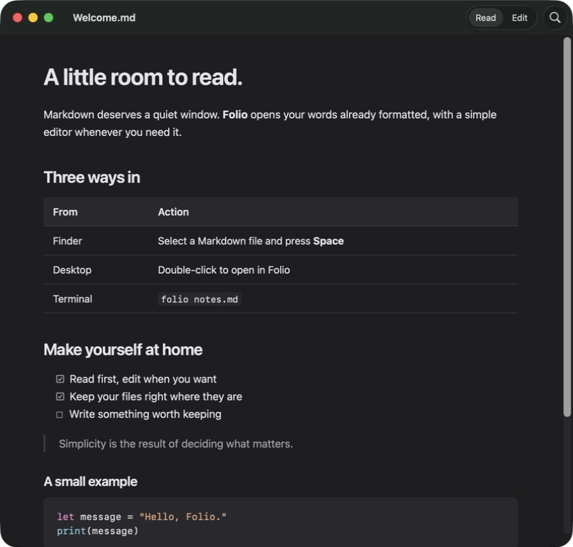

# Folio

**Preview for Markdown.** A small native macOS reader, basic editor, and Finder Quick Look extension.

- **Space** in Finder → a formatted preview.
- **Double-click** → a native window, already rendered.
- **`folio notes.md`** → that same window from Terminal.
- **⌘E** → source editing. **⌘S** → save. **⌘F** → find.



macOS 14+, Apple Silicon first. No account, server, subscription, or telemetry.

## Build and install

Requires Swift 6.2+ (current Apple Command Line Tools or Xcode), Python 3, and Git. Dependencies are pinned in `Package.resolved`.

```sh
git clone https://github.com/nebluda/folio.git
cd folio
python3 scripts/package.py
scripts/install.sh
```

This installs `~/Applications/Folio.app` and `~/.local/bin/folio`. Add `~/.local/bin` to your shell's PATH if needed. Run `scripts/uninstall.sh` to remove both; documents are untouched.

Builds are ad-hoc signed for local use. This prototype is **not notarized**. Public download distribution will require Developer ID signing and notarization.

## Finder setup

Launch Folio once. In **System Settings → General → Login Items & Extensions → Quick Look**, enable **Folio Preview**. The Help menu links to extension settings. If another Markdown preview extension is selected (for example MarkEdit), choose Folio there. Test by selecting a `.md` file in Finder and pressing **Space**; `qlmanage -p` is not a reliable test of modern preview extensions.

For double-click: select a Markdown file → **Get Info → Open with → Folio → Change All**. Repeat for `.markdown` if necessary. Installing Folio does not remove other editors or their extensions.

## CLI

```sh
folio README.md
folio "notes with spaces.md" other.markdown
folio -- -filename.md
folio                       # Open dialog
folio --help
folio --version
```

The command resolves relative paths from the current directory. Invalid options, missing files, directories, and launch failures return a nonzero status. `FOLIO_APP_PATH` overrides the installed app location.

## Reading and editing

GitHub-style headings, lists, task lists, tables, links, images, and highlighted code. Rendered reading is the default; source editing is an explicit mode. Windows support New, Open Recent, Save As, undo/redo, Find, and zoom. Close with unsaved edits offers Save, Don't Save, or Cancel.

External changes reload a clean document. If you have unsaved edits, Folio lets you reload or keep them and save a separate copy. It refuses to overwrite a disk version it has not loaded.

UTF-8 and an optional BOM are supported. Unedited content round-trips byte for byte. Edited files retain their existing LF, CRLF, or CR convention (mixed line endings are normalized to the detected convention after an edit). Invalid UTF-8 and files above 20 MB are rejected without changing them.

Images are embedded from the document folder, including subfolders, up to 5 MB each. Paths escaping that folder, SVG, and remote images are represented by placeholders. Quick Look's sandbox may also prevent access to sibling images. Raw HTML is shown as text, document JavaScript is blocked, and external links open only when clicked. All parsing, styles, and highlighting are bundled and work offline.

## Development and tests

```sh
swift test                  # Requires full Xcode for XCTest
python3 scripts/package.py
python3 scripts/test-cli.py
brew install xcodegen
xcodegen generate
xcodebuild test -project Folio.xcodeproj -scheme Folio -destination 'platform=macOS'
```

The Swift package contains shared rendering/file/CLI logic, the AppKit document app, and the Quick Look provider. `project.yml` generates the checked-in Xcode project used for UI tests. CI runs unit, document, CLI process, and native UI tests, and uploads an app bundle and UI test results.

Swift Markdown 0.9.0 (Apache 2.0 with Runtime Library Exception) provides the parser. highlight.js 11.11.1 (BSD 3-Clause) is vendored with its license; syntax highlighting runs through JavaScriptCore and produces static HTML. Folio itself is MIT licensed.
